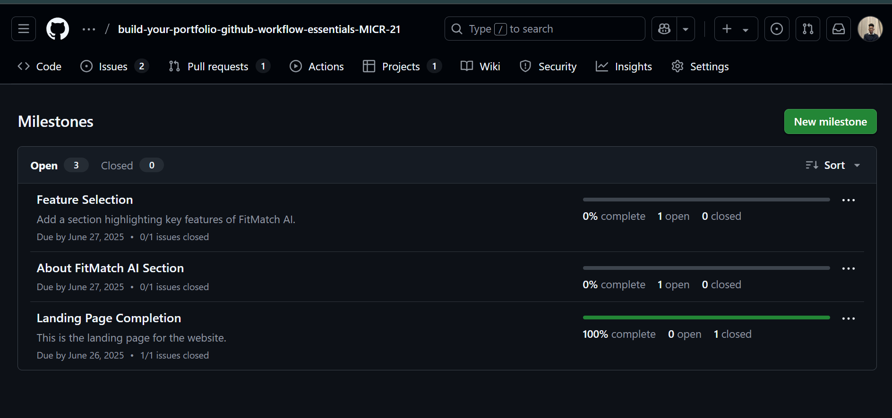
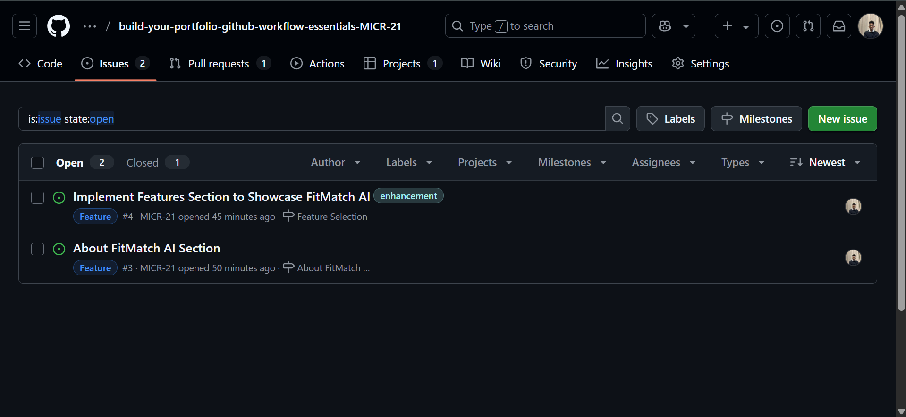
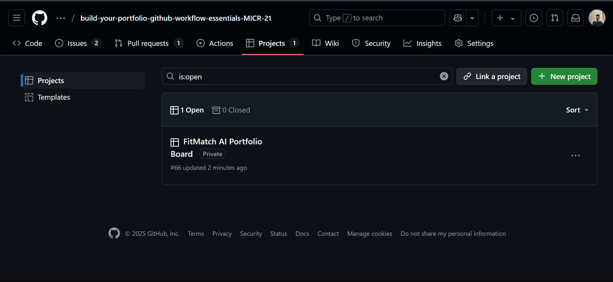
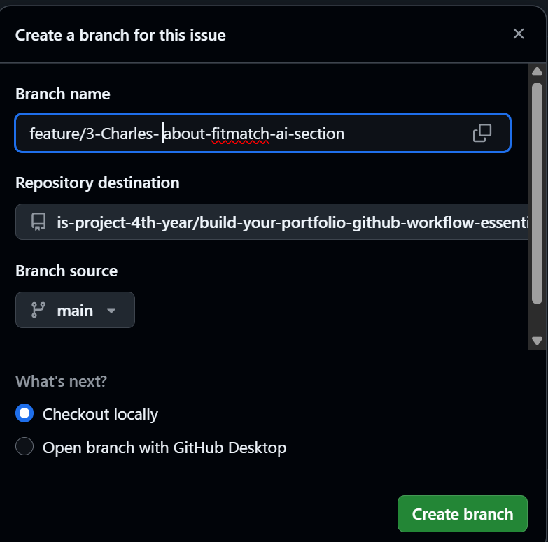
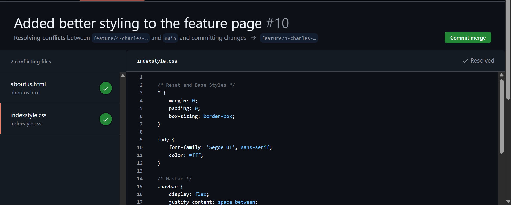
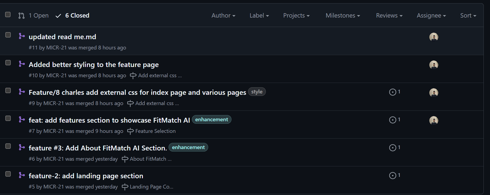
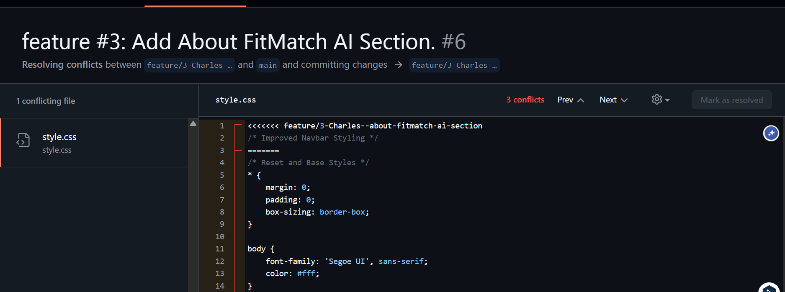

# Personal Portfolio Documentation

## 1. Student Details

- **Maina Charles Gacari**:
- **145404**:
- **MICR_21**:
- **charles.gacar@strathmore.edu**:

## 2. Deployed Portfolio Link

- **https://is-project-4th-year.github.io/build-your-portfolio-github-workflow-essentials-MICR-21/**

## 3. Learnings from the Git Crash Program

### 1. Project Boards

- Expectation : I didnt think one needed a project board to code work in teams.

- Reality: In reality it serves a visual representation of a to do list that helps in tracking one's progress. Also moving from to-do to done and vide versa was also a bit satisfying.

- Impact: Helped in organisation and clear movements of tasks from one checklist to the next.

### 2. Git Branching

- Expectation: I didnt expect us to create a branch for each new feature one would add. I just thought we would us the common branches e.g test and i thought it would be a bit hard to manage.

- Reality:Creating branches for each section e.g landing page, feature section was very straightforward and it did make my work tree clean.

- Impact: Branching allowed me to work on different parts of the project without messing up the main portfolio.

### 3. Pull Requests

- Expectation: I assumed pull requests were only for big open-source projects with many contributors.

- Reality: Even for my small project, Pull Requests made it easy to review changes and link them to specific issues.

- Impact: It improved my workflow, ensured issues were properly closed, and kept my commits structured.

### 4. Merge Conflict Resolution

- Expectation: I thought resolving merge conflicts would be stressful and very technical.

- Reality: With guidance, it was manageable. The key is understanding the conflict markers and carefully choosing the correct code.

- Impact: Gave me confidence to handle version control issues and kept my project stable even after conflicts.

## 4. Screenshots of Key GitHub Features

### A. Milestones and Issues

 Image above shows the various issues I had created as well as their completions.

 shows the issues i created and linked them to the different milestones I had created for a specific issue.

### B. Project Board

 Image above  shows my the simple overview of my project board.

 Image above shows my project board in detail with the issues that are in the to-do, progress and done section.

### C. Branching

 Image above shows one of the branches I made for the about section and that is where I implemented the code for the about issue.

### D. Pull Requests

 Image above  shows the pull request that is related to issue # 10 as being resolved.

 Image above  shows the pull requests that have been closed and are linked to the issues.

 Image above shows the whole merged pull request with the isssues linked, the project is also linked

### E. Merge Conflict Resolution

 Image above shows that there was  a merge conflict between the feature branch and my main branch and it arose because of the css stylesheet.

 Image above  shows how i was able to merge the conflict and get no more conflicts. After resolving the conflicts I was able to merge to main.
